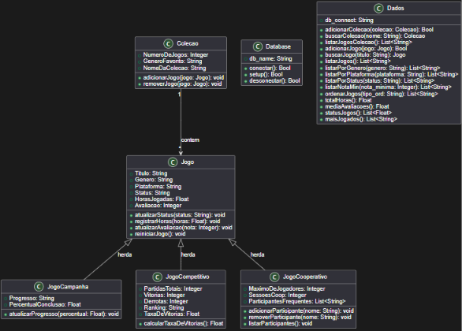

<h1 align="center"> Catalogo de Jogos</h1>
Software para o Tema 4 do trabalho de Programação Orientada a Objetos do curso de Engenharia de Software da UFCA. 
**Integrante:** Robson Arthur Matias Marques 
**Matrícula:** 2026002676

## Sumário
- [Requisitos](#requisitos)
- [Estrutura de arquivos](#estrutura-de-arquivos)
- [Decisão de design](#decisão-de-design)
- [Descrição do projeto](#descrição-do-projeto)
- [Objetivos](#objetivos)
- [Estrutura das classes](#estrutura-das-classes)
- [Instruções de uso](#instruções-de-uso)
- [Testes realizados](#testes-realizados)

## Requisitos

## Estrutura de arquivos

## Decisão de design

## Descrição do projeto
Um CLI(*Command Line Interface*) usando subcomandos direto do terminal para executar os métodos necessários para o sistema atráves de um arquivo python. O sistema será usado para gerenciar um catálogo de jogos digitais, sendo possível interagir com jogos de diferentes tipos(CRUD), criar coleções de jogos, gerenciar estados dos jogos, filtrar jogos e coleções, criar relatórios personalizados e configurar o banco de dados. 

## Objetivos
Gerenciar o funcionamento de um sistema de catálogo de jogos digitais, agilizando processos e organizando dados diversos em diferentes categorias, possibilitando a visualização, inserção, remoção e edição desses dados.

## Estrutura das classes
- Classe base Jogo:
    - Atributos:
        - Título, Gênero, Plataforma, Status, Horas Jogadas, Avaliação
        

- SubClasse JogoCampanha:
    - Atributos:
        - Herda todos os atríbutos da classe base Jogo
        - Progresso, Percentual de Conclusão

- SubClasse JogoCompetitivo:
    - Atributos:
        - Herda todos os atríbutos da classe base Jogo
        - Partidas Totais, Vitórias, Derrotas, Ranking, Taxa de vitórias

- SubClasse JogoCooperativo:
    - Atributos:
        - Herda todos os atríbutos da classe base Jogo
        - Máximo de Jogadores, Sessões Coop, Participantes Frequentes

- Classe Colecao:
    - Atributos:
        - Número de Jogos, Gênero Favorito, Nome da Coleção

## UML textual

## Instruções de uso

## Testes realizados

