<h1 align="center"> Catalogo de Jogos</h1>

Software para o Tema 4 do trabalho de Programação Orientada a Objetos do curso de Engenharia de Software da UFCA.<br>
**Integrante:** Robson Arthur Matias Marques<br>
**Matrícula:** 2026002676

## Sumário
- [Requisitos](#requisitos)
- [Estrutura de arquivos](#estrutura-de-arquivos)
- [Decisão de design](#decisão-de-design)
- [Descrição do projeto](#descrição-do-projeto)
- [Objetivos](#objetivos)
- [Estrutura das classes](#estrutura-das-classes)
- [Instruções de uso](#instruções-de-uso)
- [Exemplos de uso](#exemplo-de-uso)

## Requisitos
- Python 3.10+
- GIT

## Estrutura de arquivos
```
Catalogo-de-Jogos/
├── docs/
│    ├──UML/
│    │   ├── $UML.drawio.bkp
│    │   ├── UML.drawio
│    │   └── UML.drawio.png
│    └── img/
│         ├── imagens usadas no README.md
│         .
│         .
│         .
│
├── src/
│   ├── classes/
│   │   ├── __init__.py
│   │   ├── Colecao.py
│   │   ├── Jogo.py
│   │   ├── JogoCampanha.py
│   │   ├── JogoCompetitivo.py
│   │   └── JogoCooperativo.py
│   │
│   └── database/
│       ├── __init__.py
│       ├── dados.db
│       ├── dados.py
│       └── database.py
│
├── .gitignore
├── main.py
└── README.md
```

## Decisão de design
### Módulos
Inicialmente, decidi implementar todas as classes em um só arquivo ```classes.py```, mas isso pareceu desorganizado, então, criei um pacote com arquivos para cada classe, incluindo um pacote para a conexão e interação com o banco de dados, ```classes/``` e ```database/``` respectivamente.
### Banco de dados
Para relacionar as 4 classes principais(Colecao, Jogo, JogoCampanha, JogoCompetitivo e JogoCooperativo) criei 6 tabelas, colecoes, que contém apenas as colunas nomes, número de jogos e títulos dos jogos, jogos, que contém todos os atributos principais, colecoes_jogos, que relacionam o id de uma coleção com o id de um jogo, definindo quais jogos pertencem a quais coleções, e as 3 tabelas das subclasses jogos_campanha, jogos_cooperativos e jogos_competitivos que têm seus próprio atributos e são relacionados com um id da tabela jogos.
### Importações Locais
Ao importar em uma classe a classe dados.py que também importava as classes principais, ocorreu um erro de importação circular, por isso, decidi importar localmente as classes dentro dos métodos e não na inicialização do arquivo da classe.

## Descrição do projeto
Um CLI(*Command Line Interface*) usando subcomandos direto do terminal para executar os métodos necessários para o sistema atráves de um arquivo python. O sistema será usado para gerenciar um catálogo de jogos digitais, sendo possível interagir com jogos de diferentes tipos(CRUD), criar coleções de jogos, gerenciar estados dos jogos, filtrar jogos e coleções, criar relatórios personalizados e configurar o banco de dados. 

## Objetivos
Gerenciar o funcionamento de um sistema de catálogo de jogos digitais, agilizando processos e organizando dados diversos em diferentes categorias, possibilitando a visualização, inserção, remoção e edição desses dados. O objetivo principal é exercitar o uso de objetos e classes, além de implementar um banco de dados feito com SQLite.

## Estrutura das classes
- Classe base Jogo:
    - Atributos:
        - Título, Gênero, Plataforma, Status[NÃO INICIADO, JOGANDO, FINALIZADO], Horas Jogadas, Avaliação[0-10]
    - Métodos:
      - ```atualizarStatus()```, ```registrarHoras()```, ```atualizarAvaliacao()```, ```reiniciarJogo()```

- SubClasse JogoCampanha:
    - Atributos:
        - Herda todos os atríbutos da classe base Jogo
        - Progresso, Percentual de Conclusão
    - Métodos:
      - Herda todos os métodos da classe base Jogo
      - ```atualizarProgresso()```, ```atualizarPercentual()```, ```reinicarJogo()```

- SubClasse JogoCompetitivo:
    - Atributos:
        - Herda todos os atríbutos da classe base Jogo
        - Partidas Totais, Vitórias, Derrotas, Ranking, Taxa de vitórias
    - Métodos:
      - Herda todos os métodos da classe base Jogo
      - ```calcularTaxaVit()```, ```registrarVit()```, ```registrarDer()```, ```reiniciarJogo()```
        
- SubClasse JogoCooperativo:
    - Atributos:
        - Herda todos os atríbutos da classe base Jogo
        - Máximo de Jogadores, Sessões Coop, Participantes Frequentes
    - Métodos:
      - Herda todos os métodos da classe base Jogo
      - ```adicionarParticipante()```, ```removerParticipante()```, ```registrarSessoes()```, ```reiniciarJogo()```

- Classe Colecao:
    - Atributos:
        - Número de Jogos, Nome da Coleção, Lista com nome dos jogos
    - Métodos:
      - ```adicionarJogo()```, ```removerJogo()```, ```listarJogos()```

## UML textual
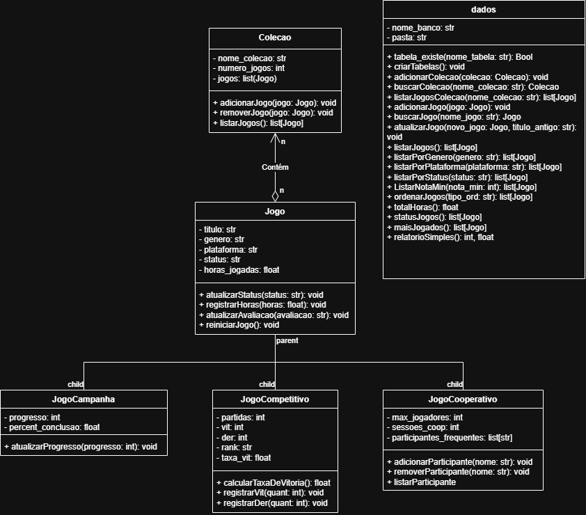

## Instruções de uso
### Passo 1 - Instalar pasta do projeto
- Clonar o repositório:
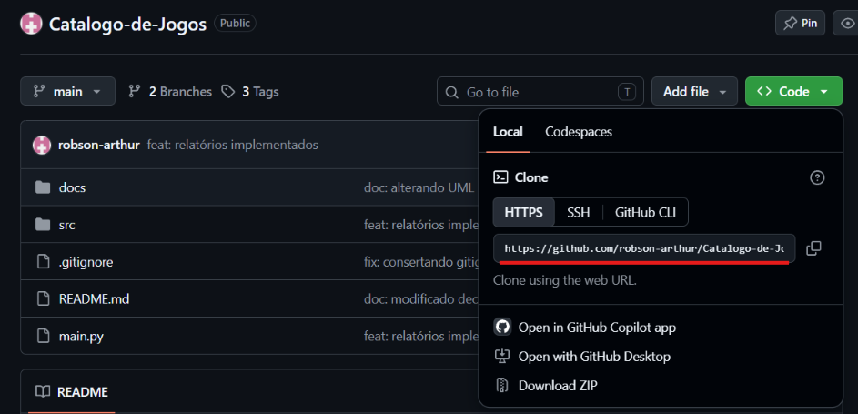
- Abra o CMD e navegue até a pasta que deseja instalar o repositório:
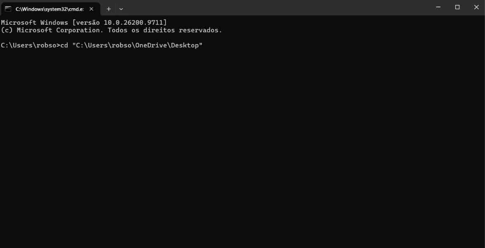
- Use `git clone <link-do-repo>` para baixar a pasta
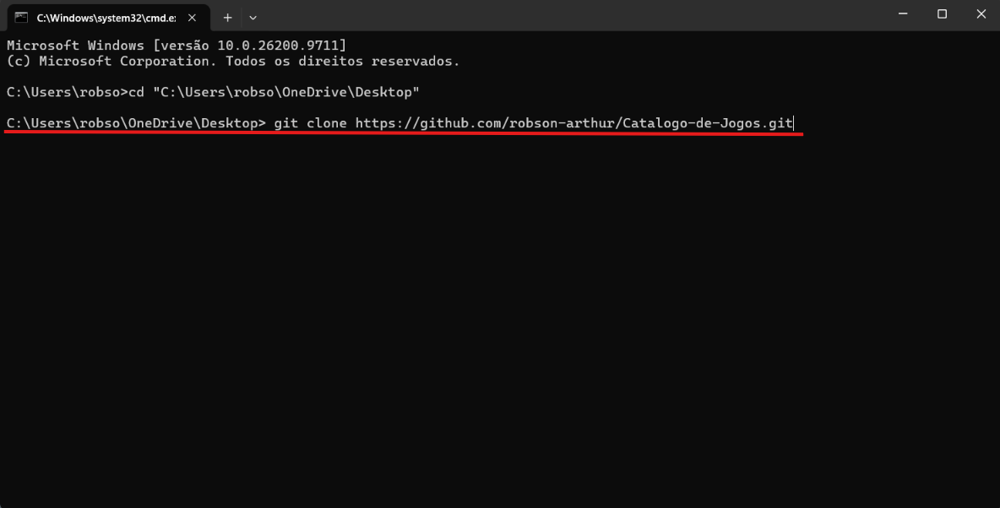

### Passo 2 - Abrir o arquivo de execução
- Abra a pasta do projeto pelo CMD:
    - Copie o caminho:
    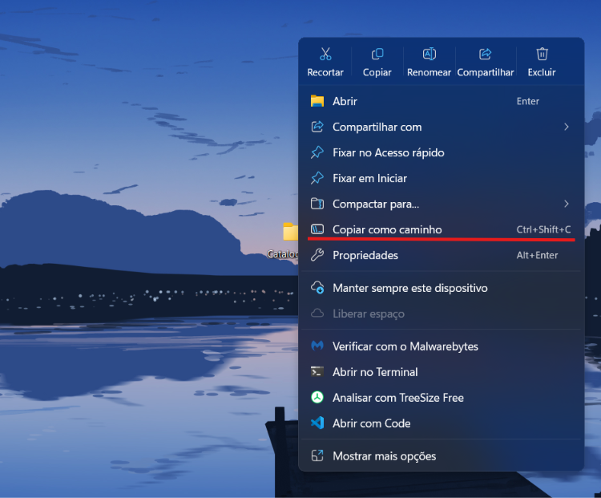
    - Abra pelo CMD:
    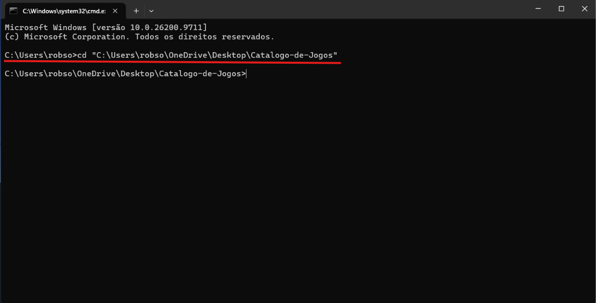

### Passo 3 - Executar comando
- Utilize sempre `python main.py` para executar os subcomando(ou `python3 main.py` caso seu sistema exija):
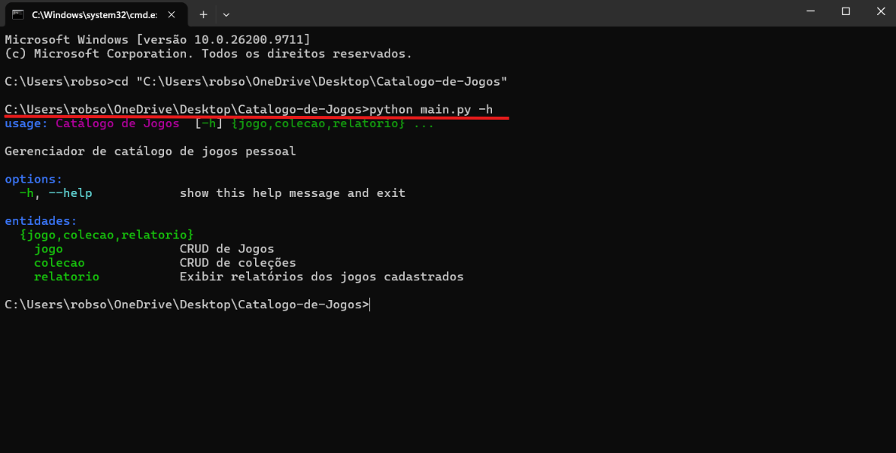
- Use `python main.py -h` para ver todos os subcomandos principais, cada subcomando também possui seu próprio `-h`

## Exemplos de uso

### Cadastrando um jogo de cada tipo
- 1. Jogo campanha
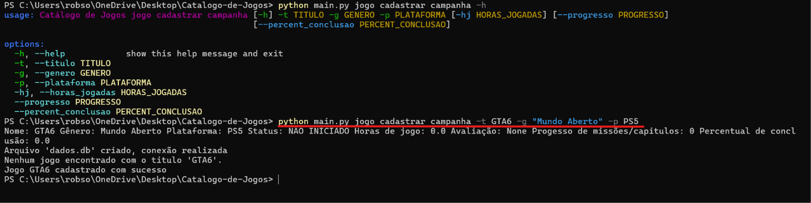
- 2. Jogo competitivo
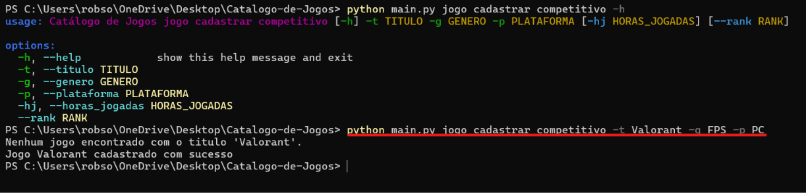
- 3. Jogo cooperativo
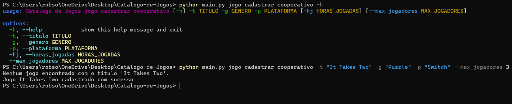

### Alterando status de um jogo qualquer
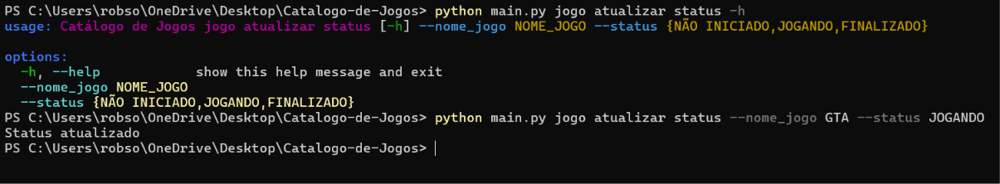

### Registrando vitórias
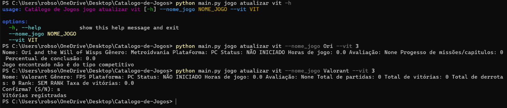

### Adicionando(ou removendo) participantes
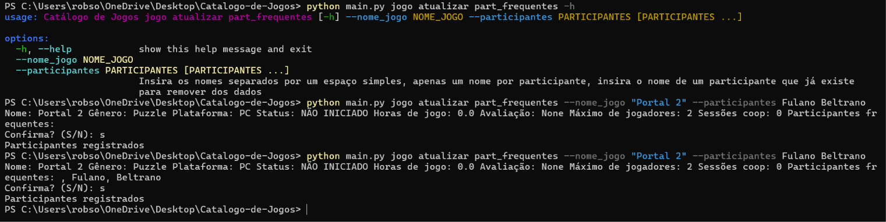

### Cadastrando coleção
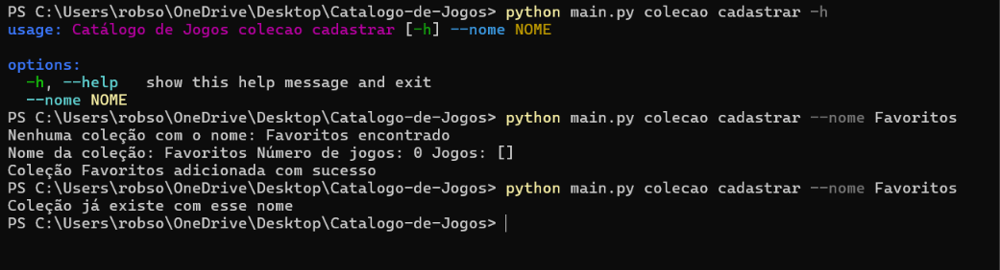

### Adicionando(ou removendo) Jogo a uma Coleção
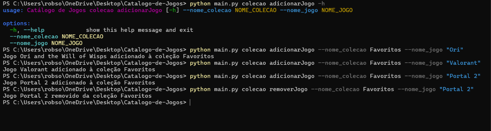

### Listando jogo com filtro em plataforma
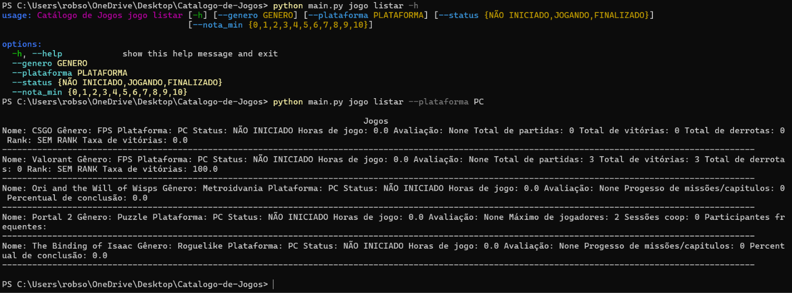

### Relatório Simples
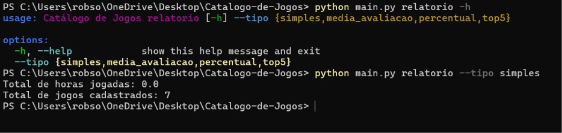
